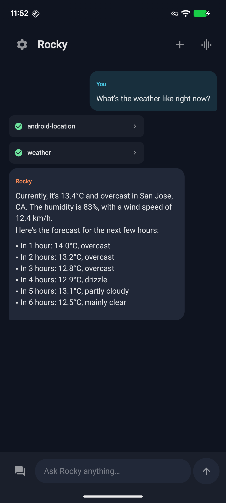
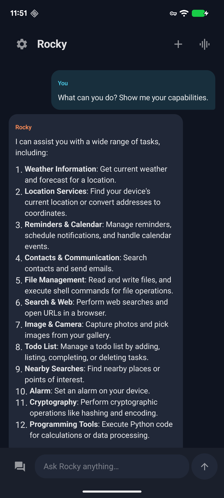
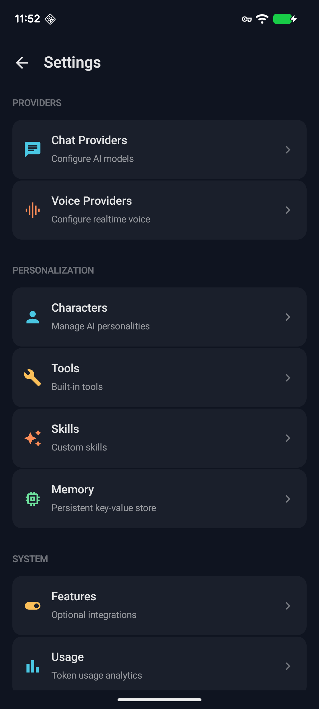

# OpenRocky Android

[](https://openrocky.org/)
[](https://discord.gg/SvvsaDA4nE)
[](https://t.me/openrocky)
[](LICENSE)
[](https://play.google.com/apps/testing/com.xnu.rocky)

> [English](README.md) | 中文

**Rocky** 是用户安装使用的 App — 一款语音优先的 Android AI Agent 应用。**OpenRocky** 是其背后的开源项目（仓库、代码库、社区）。

Rocky 不是一个移动端聊天壳子。它将语音交互、任务执行、系统桥接和结果回顾组织成一个原生的 Android Agent 体验。

> **命名约定：** 手机上的应用叫 **Rocky**，开源项目、仓库和代码标识符使用 **OpenRocky** 前缀。

## 截图

<table>
  <tr>
    <td></td>
    <td></td>
    <td></td>
  </tr>
</table>

## 特性

- **语音优先** — 语音是主要交互方式，而非聊天列表
- **30+ 原生 Android 工具** — 通讯录、日历、天气、定位、提醒事项、闹钟、相机、浏览器、加密等
- **多 AI 服务商** — 支持 OpenAI、Anthropic、Gemini、Azure、Groq、xAI、OpenRouter、DeepSeek、豆包、aiProxy
- **实时语音** — 通过 OpenAI、Gemini、豆包的实时 API 进行实时语音对话
- **自定义技能** — 内置技能 + 用户可导入的自定义技能
- **本地执行** — 通过 Chaquopy 在设备上运行受控的 Shell 和 Python 3.11
- **角色与灵魂** — 可配置的 AI 人格和声音

## 架构

```
用户语音 → 语音引擎 → AI 服务商 → ROS 运行时 → 执行层 → 结果 → UI + 语音
```

### ROS (Rocky OS) 运行时

核心执行引擎，组织以下模块：

- **会话 (Sessions)** — 对话和任务上下文，带状态管理
- **工具 (Tools)** — 30+ Android 原生服务，注册在 `Toolbox` 中
- **技能 (Skills)** — 内置技能和可导入的自定义技能，通过 `CustomSkillStore` 管理
- **语音 (Voice)** — OpenAI、Gemini、豆包的实时语音桥接
- **角色与灵魂 (Characters & Souls)** — 人格和声音配置
- **记忆 (Memory)** — 跨会话的持久化上下文

### 三层执行架构

1. **Android 原生桥接** — Kotlin 代码调用系统 API（通讯录、日历、定位等）
2. **AI 工具层** — 通过 AI 服务商 API 分发的操作
3. **本地执行** — 通过 Chaquopy 在沙盒中运行受控的 Shell/Python

### 服务商架构

三层抽象：**服务商 (Provider)** → **账户 (Account)** → **模型 (Model)**。配置在 `app/src/main/java/.../providers/` 中。

## 开发

参见 [DEVELOP_zh.md](DEVELOP_zh.md) 了解构建说明、项目结构和代码风格。

## 链接

- **官网：** https://openrocky.org/
- **iOS 开源：** https://github.com/openrocky/openrocky
- **Android 开源：** https://github.com/openrocky/openrocky_android

## 体验

- **Android 内测：** https://play.google.com/apps/testing/com.xnu.rocky

## 社区

- **Telegram：** [@openrocky](https://t.me/openrocky)
- **Discord：** https://discord.gg/SvvsaDA4nE
- **作者 X/Twitter：** [@everettjf](https://x.com/everettjf)

## 反馈

- [提交问题](https://github.com/openrocky/openrocky_android/issues/new)

## Star History

[](https://star-history.com/#openrocky/openrocky_android&Date)

## 许可证

详见 [LICENSE](LICENSE)。
